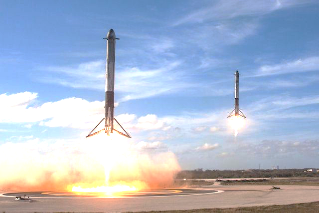
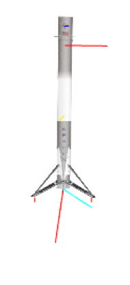
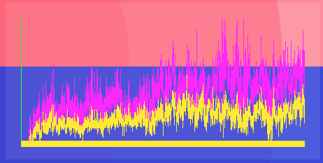
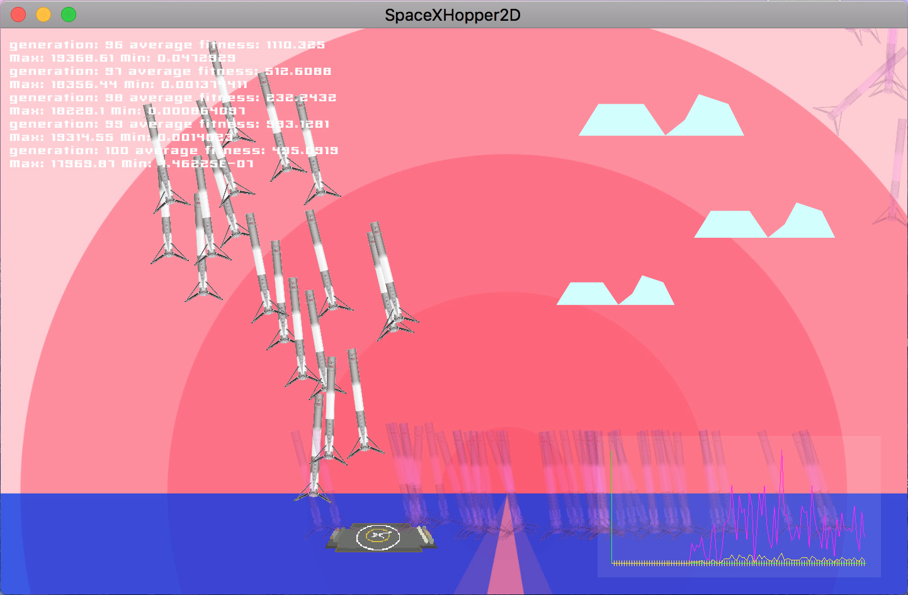

# Landing Falcon 9 rocket using NN and GA
The semestral project for the BI-ZUM (AI basics) course at FIT CTU.

## Try it out yourself!
The finished project build is playbable at: [http://stoked.cz/projects/SpaceXLander/](http://stoked.cz/projects/SpaceXLander/)

## Overview
I have implemented a 2D simulation, that teaches Falcon 9 rocket to fly using a Neural network. The goal of the spaceship is to land on the robotic droneship in the sea. The rocket has limited fuel to do so. The neural network is trained using genetic algorithms.

## Principle of solution
In this chapter, I'd like to explain the main idea behind my code. In each generation, rockets are generated on a random position. The neural network (brain) is constructed either from random weights (first generation) or as a result of breeding a previous generation. The simulation is the run for a given amount of time. When the simulation of a generation ends, the brains are evaluated and based on their fitness score bred together to create a next generation.

### Neural network
All the inputs of the neural network are normalised to a value in range of <-1, 1>. By experimenting with the hidden layers count I came up to a neural network consisting of 8 hidden layers with 10 neurons each. The neural network is described in the [Brain.cs](spacexlander/Assets/Scripts/AI/Brain.cs), neuron is in [Neuron.cs](spacexlander/Assets/Scripts/AI/Neuron.cs).

- Inputs (6)
    - x distance
    - y distance
    - x speed
    - y speed
    - z axis rotation
    - z axis rotation speed
- Hidden layers
    - 8 hidden layers by 10 neurons each
- Outputs (3)
    - engine thurst
    - engine gimball
    - top thurster thurst

### Genetic algorithm
The genetic algorithm is described in the [Genetic.cs](spacexlander/Assets/Scripts/AI/Genetic.cs) file. The fitness calculation is done in the [Handling.cs](spacexlander/Assets/Scripts/Handling.cs) script, which is responsible for controlling each rocket. 

#### Recombination
For the recombination of 2 brains a roullette wheel selection is used based on the fitness score from the previous simulation. First 2 brains are selected. Then they are recombinated to create 2 silbling based on a randomly selected crossover point.

#### Mutation
Chance of mutation is set to 3% for each neuron. If a mutation happens, a weight is randomly selected based on a gauss curve around the current value. This way small mutations happen way more often than the big ones. 

#### Fitness function

The hardest part was to create a fitness function that would motivate the rockets to land on the lander but also to progress. The fitness function is described in the [Handling.cs](spacexlander/Assets/Scripts/Handling.cs) file. In the implementation, I wanted to take in mind several things:

- during the flight
    - flight direction (bonus for flying towards the platform)
    - correct rotation (big penalisation for doing backflips)
    - flight time bonus (motivates the first generations not to fall directly to the sea)
- in case of failure (fall to the sea, hard collision)
    - distance from the platform
    - impact force
- in case of success (landed)
    - how much fuel is left
    - constant landing bonus

## Simulation controls
To generate a first generation press the "First generation button". The next generation starts automatically or by pressing the "N" key or by hitting the "Next Generation" button.

## Example of an output

[Video of a trained model after 2000 generations](docs/generace_2060.mov)

The printscreen was taken after running 100 generation. Console containing basic information is located in the left top corner. The graph in the right bottom corner shows average and top fitness.

## Conclusion
The neural network used in this project was originally developed to train cars to drive thorugh a maze. In that case, the neural net worked flawlessly and cars learned to drive through in few generations. To land a rocket turned out to be a much harder task that requires many inputs and a lot of processing power. The training is also much harder because any small change can cause a huge difference during precission tasks. In most cases over half of the rockets can land the landing module after 1000 generations.

I don't believe that neural networks are the way that SpaceX controls the landing of their rockets. It would be almost impossible to interpret what went wrong in case of a failure. 

